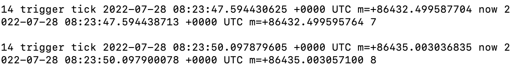

# fake-time-injector
## override
Fake-time-injector is a lightweight and flexible tool. With this tool, you can easily inject fake time values into your containers, allowing you to simulate different time scenarios and test the behavior of your applications under various time conditions

### Example
Here is an example about HPA base on Ingress QPS metric. Ingress Controller(Nginx) is a common gateway solution in kubernetes. How to autoscale your workload based on Ingress route QPS gets everyone's attention. If we collect metric in Ingress Controller that might consume too much performance. So we collect Ingress log to SLS (Log Service),analysis and make up metrics such as sls_ingress_qps,sls_ingress_latency_avg and so on. The external metrics can help developers from a different angle.

#### step1: Configure the secret containing the ca certificate
Configure webhook admission in the cluster, use the following yaml to generate a secret containing the CA certificate, note that there is no need to configure the webhookconfig.yaml file, fake-time-injector will automatically configure MutatingWebhookConfiguration

`
kubectl apply -f fake-time-injector/deploy/secret.yaml
`

#### step2: deploy the webhook and service
```yaml
apiVersion: apps/v1
kind: Deployment
metadata:
  name: kubernetes-faketime-injector
  namespace: kube-system
  labels:
    app: kubernetes-faketime-injector
spec:
  replicas: 1 # The default is primary and standby mode (currently cold standby)
  selector:
    matchLabels:
      app: kubernetes-faketime-injector
  template:
    metadata:
      labels:
        app: kubernetes-faketime-injector
    spec:
      containers:
        - image: registry.cn-hangzhou.aliyuncs.com/acs/faketime:v1
          imagePullPolicy: Always
          name: kubernetes-faketime-injector
          resources:
            limits:
              cpu: 100m
              memory: 100Mi
            requests:
              cpu: 100m
              memory: 100Mi
          env:
            - name: FAKETIME_PLUGIN_IMAGE
              value: "registry.cn-hangzhou.aliyuncs.com/acs/watchmaker:v11"
          volumeMounts:
            - name: webhook-certs
              mountPath: /run/secrets/tls
      # todo change service account to kubernetes-webhook-injector as default
      serviceAccountName: admin
      volumes:
        - name: webhook-certs
          secret:
            secretName: kubernetes-faketime-injector
---
kind: Service
apiVersion: v1
metadata:
  name: kubernetes-faketime-injector
  namespace: kube-system
spec:
  ports:
    - port: 443
      targetPort: 443
      name: webhook
  selector:
    app: kubernetes-faketime-injector
```
Deploy the yaml file.
```
kubectl apply -f deploy/kubernetes-faketime-injector.yaml 
```
#### step3: deploy the pod
You need to add two annotations to the pod.
* One of the annotations is 'game.cloudnative.io/modify-process-name', which sets the process that needs to modify the time
* Another annotation is 'game.cloudnative.io/delay-second', which sets how long the previous process needs to drift

```yaml
apiVersion: v1
kind: Pod
metadata:
  name: testpod
  namespace: kube-system
  labels:
    app: myapp
    version: v1
  annotations:
    game.cloudnative.io/modify-process-name: "hello"
    game.cloudnative.io/delay-second: "86400"
spec:
  containers:
    - name: myhello
      image: registry.cn-hangzhou.aliyuncs.com/acs/hello:v1
```

#### step4: check the result  
Use the following command to enter the 'myhello' container，The hello process will record the time to the demo.txt file every 5 seconds

`
kubectl exec -it testpod -c myhello /bin/bash -n kube-system
`

As can be seen from the results, the time is delayed by 86400 seconds


