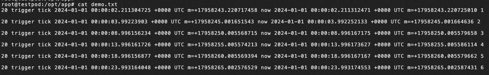
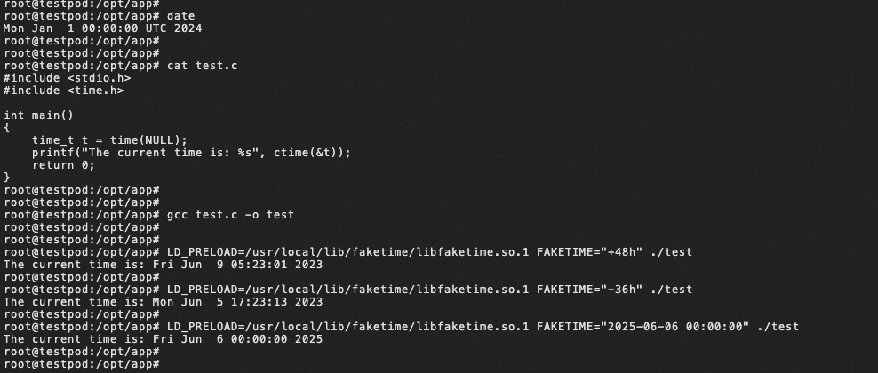

# fake-time-injector
## override
Fake-time-injector is a lightweight and flexible tool. With this tool, you can easily inject fake time values into your containers, allowing you to simulate different time scenarios and test the behavior of your applications under various time conditions

### Example
Here is an example that modifies the container's process time. Fake-time-injector uses the webhook mechanism in Kubernetes to implement request parsing changes. After you deploy this component in the container, you can modify the specific container time in the pod by writing a yaml file through certain rules. The basic principle is to enable this component to have the ability to modify the container time by configuring the FAKETIME plugin and LIBFAKETIME plugin.
#### step1: Configure the secret containing the ca certificate
Configure webhook admission in the cluster, use the following yaml to generate a secret containing the CA certificate, note that there is no need to configure the webhookconfig.yaml file, fake-time-injector will automatically configure MutatingWebhookConfiguration

* First you need to install the 'cfssl' that you need to use to create the certificate
```shell
wget -q https://pkg.cfssl.org/R1.2/cfssl_linux-amd64 https://pkg.cfssl.org/R1.2/cfssljson_linux-amd64
chmod +x cfssl_linux-amd64 cfssljson_linux-amd64 
sudo mv cfssl_linux-amd64 /usr/local/bin/cfssl
sudo mv cfssljson_linux-amd64 /usr/local/bin/cfssljson
```

* Create a CA certificate using the following json fil

```shell
cat > ca-config.json <<EOF
> {
>     "signing": {
>         "default": {
>             "expiry": "8760h"
>         },
>         "profiles": {
>             "server": {
>                 "usages": [
>                     "signing",
>                     "key encipherment",
>                     "server auth",
>                     "client auth"
>                 ],
>                 "expiry": "8760h"
>             }
>         }
>     }
> }
> EOF

cat > ca-csr.json <<EOF 
{
    "CN": "Kubernetes",
    "key": {
        "algo": "rsa",
        "size": 2048
    },
    "names": [
        {
            "C": "US",
            "L": "Portland",
            "O": "Kubernetes",
            "OU": "CA",
            "ST": "Oregon"
        }
    ]
} 
EOF

cfssl gencert -initca ca-csr.json | cfssljson -bare ca 
```

* Creating a Server Cert

```shell
cat > server-csr.json <<EOF 
{
    "CN": "admission",
    "key": {
        "algo": "rsa",
        "size": 2048
    },
    "names": [
        {
            "C": "US",
            "L": "Portland",
            "O": "Kubernetes",
            "OU": "Kubernetes",
            "ST": "Oregon"
        }
    ]
} 
EOF

cfssl gencert -ca=ca.pem -ca-key=ca-key.pem -config=ca-config.json -hostname=kubernetes-faketime-injector.kube-system.svc -profile=server server-csr.json | cfssljson -bare server
```

* Base64 encryption of the generated certificate

```shell
cat ca.pem | base64
cat server.pem | base64
cat server-key.pem | base64
```

* Use the key from the previous step to generate the secret

```shell
cat > secret.yaml <<EOF
apiVersion: v1
data:
  ca-cert.pem: xxxxxxxxx
  server-cert.pem: xxxxxx
  server-key.pem: xxxxxxx
kind: Secret
metadata:
  name: kubernetes-faketime-injector
  namespace: kube-system
  EOF

  kubectl apply -f secret.yaml
```

#### step2: deploy the webhook and service
```yaml
apiVersion: apps/v1
kind: Deployment
metadata:
  name: kubernetes-faketime-injector
  namespace: kube-system
  labels:
    app: kubernetes-faketime-injector
spec:
  replicas: 1 # The default is primary and standby mode (currently cold standby)
  selector:
    matchLabels:
      app: kubernetes-faketime-injector
  template:
    metadata:
      labels:
        app: kubernetes-faketime-injector
    spec:
      containers:
        - image: registry.cn-hangzhou.aliyuncs.com/acs/fake-time-injector:v1     // docker build -t fake-time-injector:v1 . -f fake-time-injector/Dockerfile
          imagePullPolicy: Always
          name: kubernetes-faketime-injector
          resources:
            limits:
              cpu: 100m
              memory: 100Mi
            requests:
              cpu: 100m
              memory: 100Mi
          env:
            - name: LIBFAKETIME_PLUGIN_IMAGE
              value: "registry.cn-hangzhou.aliyuncs.com/acs/libfaketime:v1"
            - name: FAKETIME_PLUGIN_IMAGE
              value: "registry.cn-hangzhou.aliyuncs.com/acs/fake-time-sidecar:v1"   // docker build -t fake-time-sidecar:v1 . -f fake-time-injector/plugins/faketime/build/Dockerfile
          volumeMounts:
            - name: webhook-certs
              mountPath: /run/secrets/tls
      # todo change service account to kubernetes-webhook-injector as default
      serviceAccountName: admin
      volumes:
        - name: webhook-certs
          secret:
            secretName: kubernetes-faketime-injector
---
kind: Service
apiVersion: v1
metadata:
  name: kubernetes-faketime-injector
  namespace: kube-system
spec:
  ports:
    - port: 443
      targetPort: 443
      name: webhook
  selector:
    app: kubernetes-faketime-injector
```
Deploy the yaml file.
```
kubectl apply -f deploy/kubernetes-faketime-injector.yaml 
```
#### step3: deploy the pod 
You need to add two annotations to the pod.
* One of the annotations is 'game.cloudnative.io/modify-process-name', which sets the process that needs to modify the time
* Another annotation is 'game.cloudnative.io/fake-time', which sets delay time

```yaml
apiVersion: v1
kind: Pod
metadata:
  name: testpod
  namespace: kube-system
  labels:
    app: myapp
    version: v1
  annotations:
    game.cloudnative.io/modify-process-name: "hello"
    game.cloudnative.io/fake-time: "2024-01-01 00:00:00"
spec:
  containers:
    - name: myhello
      image: registry.cn-hangzhou.aliyuncs.com/acs/hello:v1
      volumeMounts:
        - mountPath: /usr/local/lib/faketime
          name: faketime
  volumes:
    - name: faketime
      emptyDir: {}
```
Use the following command to enter the 'myhello' container,The hello process will record the time to the demo.txt file every 5 seconds

`
kubectl exec -it testpod -c myhello /bin/bash -n kube-system
`


We also provide another usage to let the time stay at the set time when the container is generated
```yaml
apiVersion: v1
kind: Pod
metadata:
  name: testpod
  namespace: kube-system
  labels:
    app: myapp
    version: v1
  annotations:
    game.cloudnative.io/modify-process-name: "hello"
    game.cloudnative.io/fake-time: "2024-01-01 00:00:00"
spec:
  containers:
    - env:
        - name: LD_PRELOAD      // add the path to the libfaketime.so.1
          value: /usr/local/lib/faketime/libfaketime.so.1
        - name: FAKETIME       // add the time to be modified
          value: "@2024-01-01 00:00:00"
      name: myhello
      image: registry.cn-hangzhou.aliyuncs.com/acs/hello:v1
      volumeMounts:
        - mountPath: /usr/local/lib/faketime
          name: faketime
  volumes:
    - name: faketime
      emptyDir: {}
```
You can also execute commands in virtual time


## Alternative Solution

Here is another method recommended for you, directly add sidecar to the pod that needs to modify the time, then you need to set two environment variables are 'modify_process_name' and 'delay_second'

```yaml
apiVersion: v1
kind: Pod
metadata:
  labels:
    name: hello
  name: hello
spec:
  containers:
    - image: 'registry.cn-hangzhou.aliyuncs.com/acs/hello:v1'
      imagePullPolicy: IfNotPresent
      name: myhello
    - env:
        - name: modify_process_name
          value: hello
        - name: delay_second
          value: '86400'
      image: 'registry.cn-hangzhou.aliyuncs.com/acs/fake-time-sidecar:v1'
      imagePullPolicy: Always
      name: fake-time-sidecar
  shareProcessNamespace: true
```