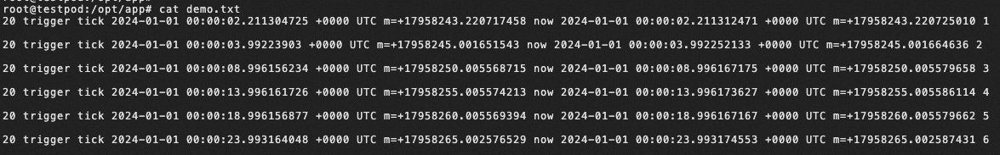
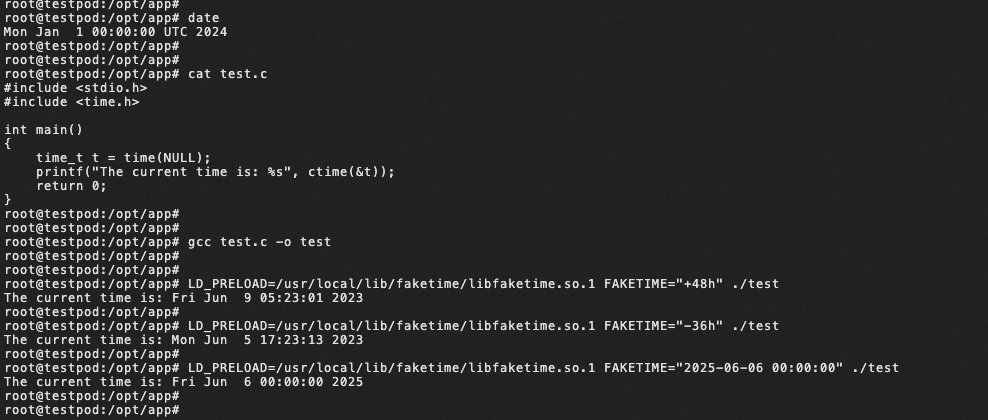

# fake-time-injector

[中文](../../README.md) | English

## overview

fake-time-injector is a lightweight and flexible tool. using this tool, you can easily inject future fake time values into containers in order to simulate and test the behavior of your application in different time scenarios.

fake-time-injector is a component used to modify simulation time in cloud-native scenarios, open-sourced by Aliyun and Lilith Games together through the CloudNativeGame community.


## Plugin Supported Programming Languages

* Go
* C
* C++
* Erlang
* Ruby
* PHP
* JavaScript
* Python
* Java

## Example

Here's an example of how you can modify a container's process time using Fake-Time-Injector. This tool uses the webhook mechanism in Kubernetes to implement request parsing changes. Once you deploy this component in your container, you can modify the specific container time in your pod by writing a YAML file according to certain rules. The basic principle is to enable this component to modify the container time by configuring the FAKETIME plugin and LIBFAKETIME plugin.

### step1: deploy fake-time-injector

Deploy fake-time-injector using the following YAML file:


```yaml
apiVersion: v1
kind: ServiceAccount
metadata:
  name: fake-time-injector-sa
  namespace: kube-system
---
apiVersion: rbac.authorization.k8s.io/v1
kind: ClusterRole
metadata:
  name: fake-time-injector-cr
rules:
  - apiGroups: [""]
    resources: ["pods"]
    verbs: ["get", "list", "patch", "update", "watch"]
  - apiGroups: [""]
    resources: ["secrets"]
    verbs: ["get", "list"]
  - apiGroups: ["admissionregistration.k8s.io"]
    resources: ["mutatingwebhookconfigurations"]
    verbs: ["get", "list", "watch", "create", "update", "patch", "delete"]
---
apiVersion: rbac.authorization.k8s.io/v1
kind: ClusterRoleBinding
metadata:
  name: fake-time-injector-rb
subjects:
  - kind: ServiceAccount
    name: fake-time-injector-sa
    namespace: kube-system
roleRef:
  kind: ClusterRole
  name: fake-time-injector-cr
  apiGroup: rbac.authorization.k8s.io
---
apiVersion: apps/v1
kind: Deployment
metadata:
  name: kubernetes-faketime-injector
  namespace: kube-system
  labels:
    app: kubernetes-faketime-injector
spec:
  replicas: 1
  selector:
    matchLabels:
      app: kubernetes-faketime-injector
  template:
    metadata:
      labels:
        app: kubernetes-faketime-injector
    spec:
      containers:
        - image: registry.cn-hangzhou.aliyuncs.com/acs/fake-time-injector:v2.1     # docker build -t fake-time-injector:v1 . -f fake-time-injector/Dockerfile
          imagePullPolicy: Always
          name: kubernetes-faketime-injector
          resources:
            limits:
              cpu: 100m
              memory: 100Mi
            requests:
              cpu: 100m
              memory: 100Mi
          env:
            - name: CLUSTER_MODE   # When CLUSTER_MODE is true，all pods in the namespace get a consistent offset when started within a certain time range (40s).
              value: "true"
            - name: LIBFAKETIME_PLUGIN_IMAGE
              value: "registry.cn-hangzhou.aliyuncs.com/acs/libfaketime:v1"
            - name: FAKETIME_PLUGIN_IMAGE
              value: "registry.cn-hangzhou.aliyuncs.com/acs/fake-time-sidecar:v2"   # docker build -t fake-time-sidecar:v1 . -f fake-time-injector/plugins/faketime/build/Dockerfile
      serviceAccountName: fake-time-injector-sa
---
kind: Service
apiVersion: v1
metadata:
  name: kubernetes-faketime-injector
  namespace: kube-system
spec:
  ports:
    - port: 443
      targetPort: 443
      name: webhook
  selector:
    app: kubernetes-faketime-injector
```

Save this YAML file to a local file named deploy.yaml. Then, use the following command to deploy it:

```
kubectl apply -f deploy.yaml 
```

### step2: modify time

We provide two ways to modify process time, the watchmaker command and the libfaketime link library.

The libfaketime link library configuration method, add annotation:
Supported languages: python, c, ruby, php, c++, js, java, erlang
* cloudnativegame.io/fake-time: sets the fake time

example of yaml configuration:

```yaml
apiVersion: v1
kind: Pod
metadata:
  name: test
  namespace: kube-system
  labels:
    app: myapp
    version: v1
  annotations:
    cloudnativegame.io/fake-time: "2024-01-01 00:00:00"  # Here you can also configure '-3h', '6h', '6d', '-' to indicate past time.
spec:
  containers:
    - name: test
      image: registry.cn-hangzhou.aliyuncs.com/acs/testc:v1
```

Add the following annotation to the watchmaker configuration method.
Supported languages: go, python, ruby, php, c++
* cloudnativegame.io/process-name: sets the process that needs to modify the time
* cloudnativegame.io/fake-time: sets the fake time


example of yaml configuration:

```yaml
apiVersion: v1
kind: Pod
metadata:
  name: testpod
  namespace: kube-system
  labels:
    app: myapp
    version: v1
  annotations:
    cloudnativegame.io/process-name: "hello"     # If you need to modify multiple processes at the same time, just separate the process names with `,`
    cloudnativegame.io/fake-time: "2024-01-01 00:00:00"    # Here you can also configure the number of seconds to adjust, '86400' means that the time drifts back one day, watchmaker does not support past times.
spec:
  containers:
    - name: myhello
      image: registry.cn-hangzhou.aliyuncs.com/acs/hello:v1
```
Save this YAML file to a local file named testpod.yaml. Then, use the following command to deploy it:

```yaml
kubectl apply -f testpod.yaml
```

To enter the myhello container and test that the time is modified, use the following command:

```
kubectl exec -it testpod -c myhello /bin/bash -n kube-system
```


We also provide another method to modify the container's time, you can also have the command executed in virtual time



## Alternative Solution

We also recommend another approach for modifying time, which involves adding a sidecar container directly to the Pod. here's how you can do it:

```yaml
apiVersion: v1
kind: Pod
metadata:
  labels:
    name: hello
  name: hello
spec:
  containers:
    - image: 'registry.cn-hangzhou.aliyuncs.com/acs/hello:v1'
      imagePullPolicy: IfNotPresent
      name: myhello
    - env:
        - name: modify_process_name
          value: hello           # If you need to modify multiple processes at the same time, just separate the process names with `,`
        - name: delay_second
          value: '86400'
      image: 'registry.cn-hangzhou.aliyuncs.com/acs/fake-time-sidecar:v1'
      imagePullPolicy: Always
      name: fake-time-sidecar
  shareProcessNamespace: true
```

In this approach, you need to set two environment variables for the sidecar container: modify_process_name and delay_second. this will allow you to specify which process needs to modify the time, and the future time difference from this moment.

Also, note that we've added shareProcessNamespace to the spec to ensure that both containers share the same process namespace.

## Dependencies

This project uses the following open-source software:

* [Chaos-mesh](https://github.com/chaos-mesh/chaos-mesh) - Reference chaos-mesh's watchmaker component to simulate process time
* [Libfaketime](https://github.com/wolfcw/libfaketime) - Reference the libfaketime dynamic link library to simulate time